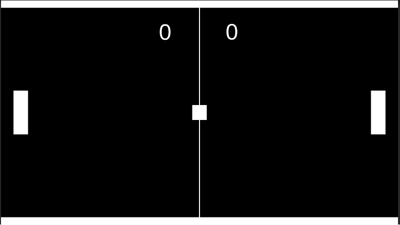

# A simple Ping pong game

Reference - [BMo](https://www.youtube.com/watch?v=YHSanceczXY&ab_channel=BMo)

To brush up my knowledge on unity, why not create a simple game that I loved as a child.

## Implementation

Consists of 4 C# scripts

1. Game manager - Ochestrates the whole game
2. Paddle - Keep tracks of user input
3. Ball - randomize ball movements
4. Goal - calls the score  when triggered

Adjust the game speed in Unity and enjoy the game.

### Snip of the game 

